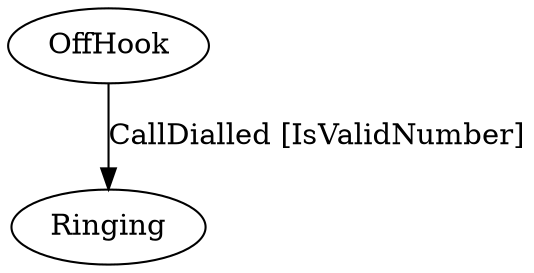

# Stateless [](https://github.com/dotnet-state-machine/stateless/actions/workflows/BuildAndTestOnPullRequests.yml) [](https://www.nuget.org/packages/stateless) [](https://gitter.im/dotnet-state-machine/stateless?utm_source=badge&utm_medium=badge&utm_campaign=pr-badge&utm_content=badge) [](http://stackoverflow.com/questions/tagged/stateless-state-machine)

**Create *state machines* and lightweight *state machine-based workflows* directly in .NET code:**

```csharp
var phoneCall = new StateMachine<State, Trigger>(State.OffHook);

phoneCall.Configure(State.OffHook)
    .Permit(Trigger.CallDialled, State.Ringing);

phoneCall.Configure(State.Connected)
    .OnEntry(t => StartCallTimer())
    .OnExit(t => StopCallTimer())
    .InternalTransition(Trigger.MuteMicrophone, t => OnMute())
    .InternalTransition(Trigger.UnmuteMicrophone, t => OnUnmute())
    .InternalTransition<int>(_setVolumeTrigger, (volume, t) => OnSetVolume(volume))
    .Permit(Trigger.LeftMessage, State.OffHook)
    .Permit(Trigger.PlacedOnHold, State.OnHold);

// ...

phoneCall.Fire(Trigger.CallDialled);
Assert.AreEqual(State.Ringing, phoneCall.State);
```

This project, as well as the example above, was inspired by [Simple State Machine](http://simplestatemachine.codeplex.com/).

## Features

Most standard state machine constructs are supported:

 * Generic support for states and triggers of any .NET type (numbers, strings, enums, etc.)
 * Hierarchical states
 * Entry/exit actions for states
 * Guard clauses to support conditional transitions
 * Introspection

Some useful extensions are also provided:

 * Ability to store state externally (for example, in a property tracked by an ORM)
 * Parameterised triggers
 * Reentrant states
 * Export to DOT graph

### Hierarchical States


In the example below, the `OnHold` state is a substate of the `Connected` state. This means that an `OnHold` call is still connected.

```csharp
phoneCall.Configure(State.OnHold)
    .SubstateOf(State.Connected)
    .Permit(Trigger.TakenOffHold, State.Connected)
    .Permit(Trigger.PhoneHurledAgainstWall, State.PhoneDestroyed);
```

In addition to the `StateMachine.State` property, which will report the precise current state, an `IsInState(State)` method is provided. `IsInState(State)` will take substates into account, so that if the example above was in the `OnHold` state, `IsInState(State.Connected)` would also evaluate to `true`.

### Entry/Exit actions

In the example, the `StartCallTimer()` method will be executed when a call is connected. The `StopCallTimer()` will be executed when call completes (by either hanging up or hurling the phone against the wall.)

The call can move between the `Connected` and `OnHold` states without the `StartCallTimer()` and `StopCallTimer()` methods being called repeatedly because the `OnHold` state is a substate of the `Connected` state.

Entry/Exit action handlers can be supplied with a parameter of type `Transition` that describes the trigger, source and destination states.

### Internal transitions

Sometimes a trigger does needs to be handled, but the state shouldn't change. This is an internal transition. Use `InternalTransition` for this.

### Initial state transitions

A substate can be marked as initial state. When the state machine enters the super state it will also automatically enter the substate. This can be configured like this:

```csharp
    sm.Configure(State.B)
        .InitialTransition(State.C);

    sm.Configure(State.C)
        .SubstateOf(State.B);
```

Due to Stateless' internal structure, it does not know when it is "started". This makes it impossible to handle an initial transition in the traditional way. It is possible to work around this limitation by adding a dummy initial state, and then use Activate() to "start" the state machine.

```csharp
    sm.Configure(InitialState)
        .OnActivate(() => sm.Fire(LetsGo)))
        .Permit(LetsGo, StateA)
```


### External State Storage

Stateless is designed to be embedded in various application models. For example, some ORMs place requirements upon where mapped data may be stored, and UI frameworks often require state to be stored in special "bindable" properties. To this end, the `StateMachine` constructor can accept function arguments that will be used to read and write the state values:

```csharp
var stateMachine = new StateMachine<State, Trigger>(
    () => myState.Value,
    s => myState.Value = s);
```

In this example the state machine will use the `myState` object for state storage.

Another example can be found in the JsonExample solution, located in the example folder. 


### Activation / Deactivation

It might be necessary to perform some code before storing the object state, and likewise when restoring the object state. Use `Deactivate` and `Activate` for this. Activation should only be called once before normal operation starts, and once before state storage. 

### Introspection

The state machine can provide a list of the triggers that can be successfully fired within the current state via the `StateMachine.PermittedTriggers` property. Use `StateMachine.GetInfo()` to retreive information about the state configuration.

### Guard Clauses

The state machine will choose between multiple transitions based on guard clauses, e.g.:

```csharp
phoneCall.Configure(State.OffHook)
    .PermitIf(Trigger.CallDialled, State.Ringing, () => IsValidNumber)
    .PermitIf(Trigger.CallDialled, State.Beeping, () => !IsValidNumber);
```

Guard clauses within a state must be mutually exclusive (multiple guard clauses cannot be valid at the same time.) Substates can override transitions by respecifying them, however substates cannot disallow transitions that are allowed by the superstate.

The guard clauses will be evaluated whenever a trigger is fired. Guards should therefor be made side effect free.

### Parameterised Triggers

Strongly-typed parameters can be assigned to triggers:

```csharp
var assignTrigger = stateMachine.SetTriggerParameters<string>(Trigger.Assign);

stateMachine.Configure(State.Assigned)
    .OnEntryFrom(assignTrigger, email => OnAssigned(email));

stateMachine.Fire(assignTrigger, "joe@example.com");
```

Trigger parameters can be used to dynamically select the destination state using the `PermitDynamic()` configuration method.

### Ignored Transitions and Reentrant States

Firing a trigger that does not have an allowed transition associated with it will cause an exception to be thrown.

To ignore triggers within certain states, use the `Ignore(TTrigger)` directive:

```csharp
phoneCall.Configure(State.Connected)
    .Ignore(Trigger.CallDialled);
```

Alternatively, a state can be marked reentrant so its entry and exit actions will fire even when transitioning from/to itself:

```csharp
stateMachine.Configure(State.Assigned)
    .PermitReentry(Trigger.Assigned)
    .OnEntry(() => SendEmailToAssignee());
```

By default, triggers must be ignored explicitly. To override Stateless's default behaviour of throwing an exception when an unhandled trigger is fired, configure the state machine using the `OnUnhandledTrigger` method:

```csharp
stateMachine.OnUnhandledTrigger((state, trigger) => { });
```

### State change notifications (events)

Stateless supports 2 types of state machine events:
 * State transition
 * State machine transition completed

#### State transition
```csharp
stateMachine.OnTransitioned((transition) => { });
```
This event will be invoked every time the state machine changes state.

#### State machine transition completed
```csharp
stateMachine.OnTransitionCompleted((transition) => { });
```
This event will be invoked at the very end of the trigger handling, after the last  entry action have been executed.

### Export to DOT graph

It can be useful to visualize state machines on runtime. With this approach the code is the authoritative source and state diagrams are by-products which are always up to date.
 
```csharp
phoneCall.Configure(State.OffHook)
    .PermitIf(Trigger.CallDialled, State.Ringing, IsValidNumber);
    
string graph = UmlDotGraph.Format(phoneCall.GetInfo());
```

The `UmlDotGraph.Format()` method returns a string representation of the state machine in the [DOT graph language](https://en.wikipedia.org/wiki/DOT_(graph_description_language)), e.g.:



This can then be rendered by tools that support the DOT graph language, such as the [dot command line tool](http://www.graphviz.org/doc/info/command.html) from [graphviz.org](http://www.graphviz.org) or [viz.js](https://github.com/mdaines/viz.js). See http://www.webgraphviz.com for instant gratification.
Command line example: `dot -T pdf -o phoneCall.pdf phoneCall.dot` to generate a PDF file.

### Async triggers

On platforms that provide `Task<T>`, the `StateMachine` supports `async` entry/exit actions and so-on:

```csharp
stateMachine.Configure(State.Assigned)
    .OnEntryAsync(async () => await SendEmailToAssignee());
```

Asynchronous handlers must be registered using the `*Async()` methods in these cases.

To fire a trigger that invokes asynchronous actions, the `FireAsync()` method must be used:

```csharp
await stateMachine.FireAsync(Trigger.Assigned);
```

**Note:** while `StateMachine` may be used _asynchronously_, it remains single-threaded and may not be used _concurrently_ by multiple threads.

## Building

Stateless runs on .NET 4.0+ and practically all modern .NET platforms by targeting .NET Standard 1.0 and .NET Standard2.0. Visual Studio 2017 or later is required to build the solution.


## Contributing

We welcome contributions to this project. Check [CONTRIBUTING.md](CONTRIBUTING.md) for more info.


## Project Goals

This page is an almost-complete description of Stateless, and its explicit aim is to remain minimal.

Please use the issue tracker or the if you'd like to report problems or discuss features.

(_Why the name? Stateless implements the set of rules regarding state transitions, but, at least when the delegate version of the constructor is used, doesn't maintain any internal state itself._)

[Visual Studio 2015 and .NET Core]: https://www.microsoft.com/net/core
